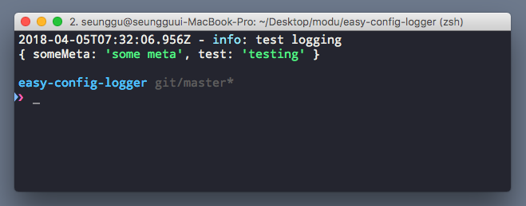

# easy-config-logger

> Typescript Support!

easy-config-logger is the logger with easy configuration. It is designed for both > readability in development and json output in production.

<br>

## Usage

### `development`, `test` env

> When dev env, logger print log as prtty print.

#### code

```javascript
const { Logger } = require('easy-config-logger');

const options = { env: 'development', level: 'debug' };
const baseMeta = { someMeta: 'some meta' }; // always included data
const logger = new Logger(options, baseMeta);

const testMeta = { test: 'testing' }; // additional data
logger.info('test logging', testMeta);
```

#### result


<br>

### `stage`, `production` env

> When prod env, logger print log as json format string.

#### code

```javascript
const { Logger } = require('easy-config-logger');

const options = { env: 'production', level: 'info' };
const baseMeta = { someMeta: 'some meta' }; // always included data
const logger = new Logger(options, baseMeta);

const testMeta = { test: 'testing' }; // additional data
logger.info('test logging', testMeta);
```

#### result


<br><br>

## Configuration

### Options

#### Options.env
> **easy-config-logger** print log according to `env`.

| env | description |
| --- | --- |
| `development`, `test` | print log with color & pretty for readability. |
| `stage`, `production` | print log as json format for log management. |

#### Options.level

##### Support Level

| level | description |
| --- | --- |
| `debug` | for debugging. |
| `info` | for information that support service matrix, etc. |
| `warn` | not error, but problem. |
| `error` | error that need prompt action. |
| `test` | for testing. |


##### Level Order

`debug` < `info` < `warn` < `warn` < `test` 

<br>

### Base Meta
> meta data that always included in log.

<br><br>

## API

### Constructor(options, baseMeta = {})

```javascript
const { Logger } = require('easy-config-logger');

const options = { env: 'development', level: 'debug' };

// with empty base meta
const logger = new Logger(options); // base meta default = {}

// with custom base meta
const baseMeta = { someMeta: 'some meta' }; // always included data
const loggerWithBaseMeta = new Logger(options, baseMeta);
```

### .debug(message, meta = {})
```javascript
logger.debug('debug message', { some_meta: 'some meta' });
```

### .info(message, meta = {})
```javascript
logger.info('info message', { some_meta: 'some meta' });
```

### .warn(message, meta = {})
```javascript
logger.warn('warn message', { some_meta: 'some meta' });
```

### .error(message, meta = {})
```javascript
const logger = new Logger(options);
logger.error('error message', { some_meta: 'some meta' });
```

### .test(message, meta = {})
```javascript
logger.test('test message', { some_meta: 'some meta' });
```

<br><br>

## License
License under the MIT License (MIT)

Copyright © 2018 [Seunggu](https://github.com/seunggu)

Permission is hereby granted, free of charge, to any person obtaining a copy of this software and associated documentation files (the "Software"), to deal in the Software without restriction, including without limitation the rights to use, copy, modify, merge, publish, distribute, sublicense, and/or sell copies of the Software, and to permit persons to whom the Software is furnished to do so, subject to the following conditions:

The above copyright notice and this permission notice shall be included in all copies or substantial portions of the Software.

THE SOFTWARE IS PROVIDED "AS IS", WITHOUT WARRANTY OF ANY KIND, EXPRESS OR IMPLIED, INCLUDING BUT NOT LIMITED TO THE WARRANTIES OF MERCHANTABILITY, FITNESS FOR A PARTICULAR PURPOSE AND NONINFRINGEMENT.

IN NO EVENT SHALL THE AUTHORS OR COPYRIGHT HOLDERS BE LIABLE FOR ANY CLAIM, DAMAGES OR OTHER LIABILITY, WHETHER IN AN ACTION OF CONTRACT, TORT OR OTHERWISE, ARISING FROM, OUT OF OR IN CONNECTION WITH THE SOFTWARE OR THE USE OR OTHER DEALINGS IN THE SOFTWARE.